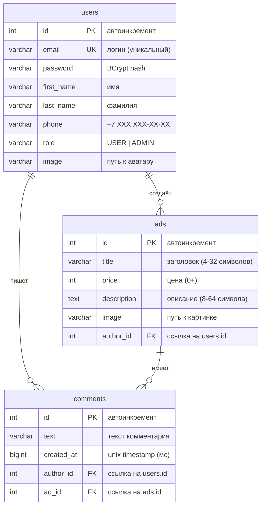
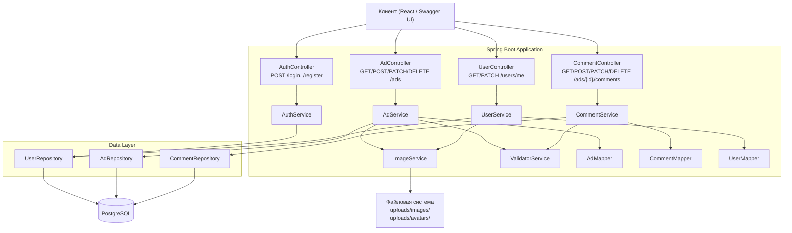
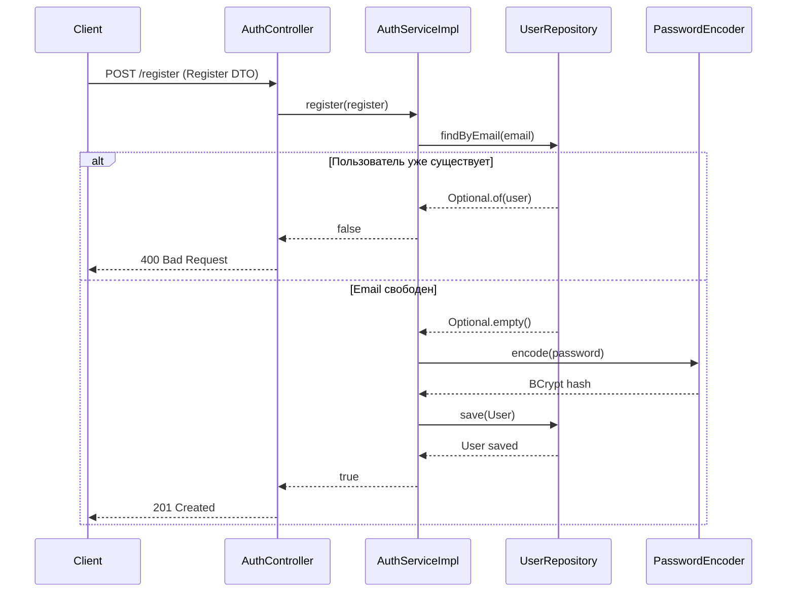
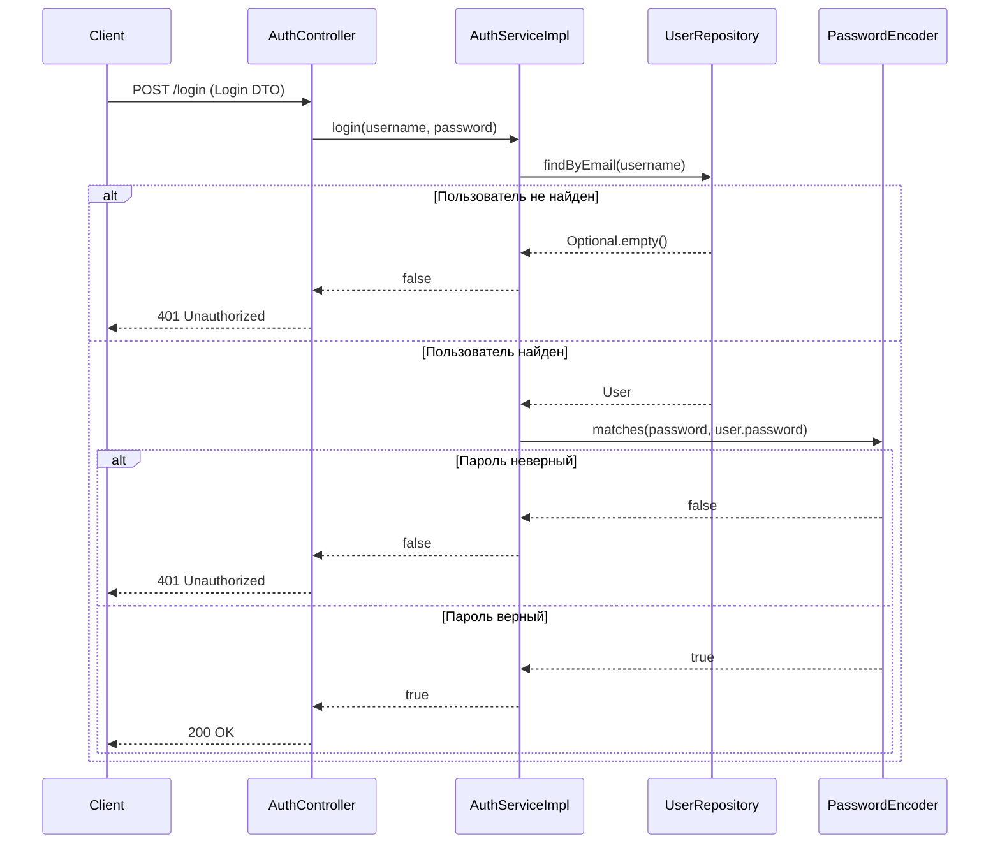
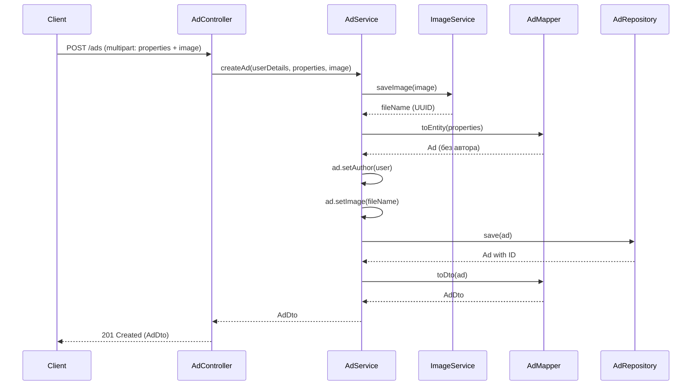
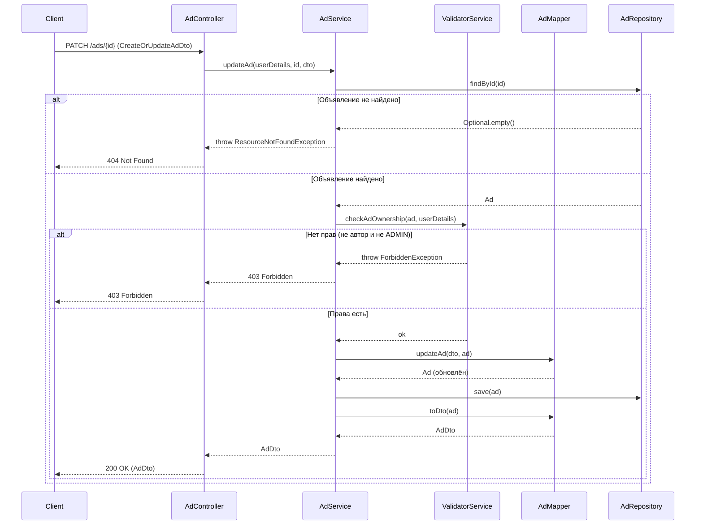
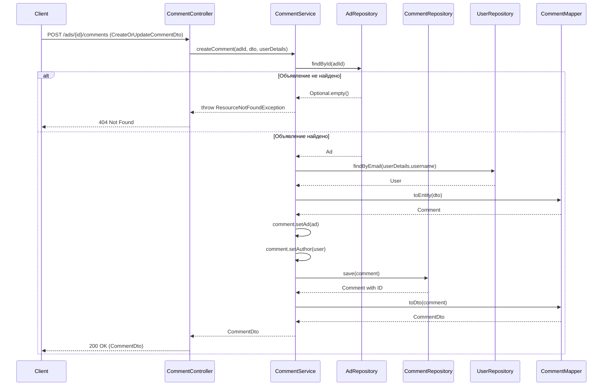
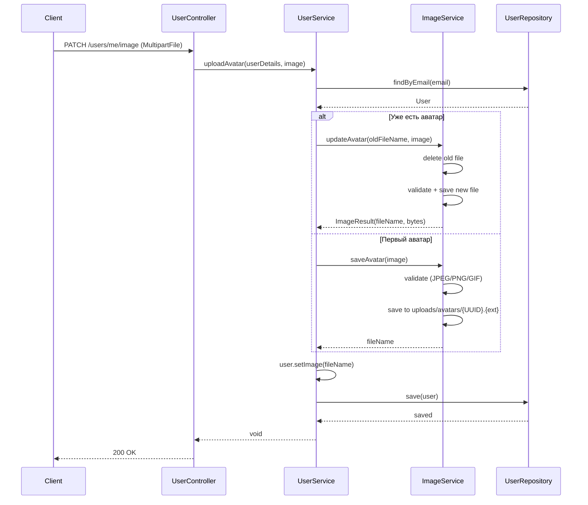
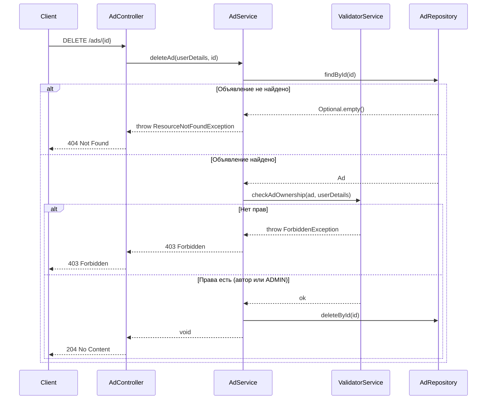

# Resale Platform — Платформа объявлений

Веб-приложение для размещения и управления объявлениями с возможностью комментирования. Разработано на Spring Boot 3.

## Функциональность

- Регистрация и аутентификация пользователей (HTTP Basic Auth)
- Управление объявлениями: создание, редактирование, удаление, просмотр
- Комментирование объявлений
- Загрузка и обновление изображений объявлений (JPEG/PNG/GIF) и аватаров пользователей
- Ролевая модель: USER (обычный пользователь) и ADMIN (полный доступ)
- Валидация данных на уровне DTO (Jakarta Validation)
- Swagger UI с полной документацией API

## Технологический стек

| Компонент | Технология |
|---|---|
| Язык | Java 17 |
| Фреймворк | Spring Boot 3.5, Spring MVC, Spring Security |
| База данных | PostgreSQL 15 |
| ORM | Spring Data JPA, Hibernate |
| Миграции БД | Liquibase |
| Маппинг DTO | MapStruct 1.5.5 |
| Валидация | Jakarta Validation (Hibernate Validator) |
| Документация API | OpenAPI / Swagger UI (SpringDoc 2.7) |
| Контейнеризация | Docker |
| Сборка | Maven |
| Тестирование | JUnit 5, Mockito, MockMvc, H2 |

## Запуск

### Требования

- Java 17+
- PostgreSQL (или Docker)
- Maven (или `./mvnw`)

### 1. Создание базы данных

```sql
CREATE DATABASE resale_platform_db;
CREATE USER resale_admin WITH PASSWORD 'resaledb';
GRANT ALL PRIVILEGES ON DATABASE resale_platform_db TO resale_admin;
```

Или через Docker:

```bash
docker run -d --name postgres -e POSTGRES_DB=resale_platform_db -e POSTGRES_USER=resale_admin -e POSTGRES_PASSWORD=resaledb -p 5432:5432 postgres:15
```

### 2. Сборка и запуск

```bash
./mvnw clean spring-boot:run
```

Приложение запустится на `http://localhost:8080`.

Миграции Liquibase выполнятся автоматически при старте.

### 3. Swagger UI

После запуска документация API доступна по адресу:

```
http://localhost:8080/swagger-ui.html
```

## Структура проекта

```
src/
├── main/java/ru/skypro/homework/
│   ├── HomeworkApplication.java        # Точка входа
│   ├── config/                         # Конфигурация Security, CORS, UserDetailsService
│   ├── controller/                     # REST-контроллеры (Auth, Ad, Comment, User)
│   ├── dto/                            # DTO (Java records) для запросов и ответов
│   │   ├── auth/                       # Login, Register
│   │   ├── ad/                         # AdDto, AdsDto, CreateOrUpdateAdDto, ExtendedAdDto
│   │   ├── comment/                    # CommentDto, CommentsDto, CreateOrUpdateCommentDto
│   │   └── user/                       # UserDto, UpdateUserDto, NewPasswordDto
│   ├── exception/                      # Исключения + глобальный обработчик (@RestControllerAdvice)
│   ├── mapper/                         # MapStruct-мапперы (AdMapper, CommentMapper, UserMapper)
│   ├── model/                          # JPA-сущности (Ad, Comment) + user/ (User, Role)
│   ├── repository/                     # Spring Data JPA репозитории
│   └── service/                        # Бизнес-логика
│       ├── AdService.java
│       ├── AuthService.java            # Интерфейс
│       ├── CommentService.java
│       ├── ImageService.java
│       ├── UserService.java
│       ├── ValidatorService.java       # Проверка прав доступа
│       └── impl/AuthServiceImpl.java
├── main/resources/
│   ├── application.properties
│   └── liquibase/                      # Миграции БД
│       ├── db.changelog-master.yaml
│       └── scripts/
│           ├── 001-create-users-table.sql
│           ├── 002-create-ads-table.sql
│           └── 003-create-comments-table.sql
└── test/java/ru/skypro/homework/
    ├── controller/                     # Интеграционные тесты контроллеров (MockMvc)
    └── service/                        # Юнит-тесты сервисов (Mockito)
```

## Конфигурация

### Файловое хранилище

В `application.properties` задаются директории для хранения изображений:

```properties
images.dir.path=uploads/images      # директория для картинок объявлений
avatars.dir.path=uploads/avatars    # директория для аватаров пользователей
```

Имена файлов формируются по шаблону `{UUID}.{расширение}` (например, `a1b2c3d4-e5f6.jpg`).

### Spring Security

- Аутентификация: HTTP Basic Auth
- Шифрование паролей: BCrypt
- CSRF: отключён (REST API)

### Тестирование

```properties
# application-test.properties (автоматически при тестировании)
spring.datasource.url=jdbc:h2:mem:testdb
spring.jpa.hibernate.ddl-auto=create-drop
```

## REST API Endpoints

### Авторизация

| Метод | URL | Auth | Описание |
|---|---|---|---|
| `POST` | `/login` | Нет | Вход в систему (Basic Auth) |
| `POST` | `/register` | Нет | Регистрация нового пользователя |

### Пользователи

| Метод | URL | Auth | Описание |
|---|---|---|---|
| `GET` | `/users/me` | USER, ADMIN | Информация о текущем пользователе |
| `PATCH` | `/users/me` | USER, ADMIN | Обновить профиль (firstName, lastName, phone) |
| `POST` | `/users/set_password` | USER, ADMIN | Сменить пароль |
| `PATCH` | `/users/me/image` | USER, ADMIN | Обновить аватар (multipart/form-data, JPEG/PNG/GIF) |
| `GET` | `/users/image/{fileName}` | Нет | Получить изображение аватара |

### Объявления

| Метод | URL | Auth | Описание |
|---|---|---|---|
| `GET` | `/ads` | Нет | Все объявления |
| `GET` | `/ads/me` | USER, ADMIN | Мои объявления |
| `GET` | `/ads/{id}` | Нет | Детали объявления |
| `POST` | `/ads` | USER, ADMIN | Создать объявление (multipart: properties + image) |
| `PATCH` | `/ads/{id}` | USER, ADMIN | Обновить объявление |
| `DELETE` | `/ads/{id}` | USER, ADMIN | Удалить объявление |
| `PATCH` | `/ads/{id}/image` | USER, ADMIN | Обновить изображение (multipart, JPEG/PNG/GIF) |
| `GET` | `/ads/image/{fileName}` | Нет | Получить изображение объявления |

### Комментарии

| Метод | URL | Auth | Описание |
|---|---|---|---|
| `GET` | `/ads/{id}/comments` | Нет | Комментарии объявления |
| `POST` | `/ads/{id}/comments` | USER, ADMIN | Добавить комментарий |
| `PATCH` | `/ads/{adId}/comments/{id}` | USER, ADMIN | Обновить комментарий |
| `DELETE` | `/ads/{adId}/comments/{id}` | USER, ADMIN | Удалить комментарий |

## Модель безопасности

| Роль | Чтение | Создание | Редактирование | Удаление |
|---|---|---|---|---|
| Гость (нет auth) | Объявления, комментарии, изображения | Нет | Нет | Нет |
| USER | Все + свои объявления | Объявления, комментарии | Свои объявления, свои комментарии | Свои объявления, свои комментарии |
| ADMIN | Все | Объявления, комментарии | Любые объявления, любые комментарии | Любые объявления, любые комментарии |

Проверка прав доступа выполняется через `ValidatorService`:

- **Владелец объявления**: `ad.author.email == userDetails.username`
- **Владелец комментария**: `comment.author.email == userDetails.username`
- **ADMIN**: пропускает все проверки прав

## Схема базы данных



## Архитектура



## Диаграммы последовательности

### Регистрация нового пользователя



### Вход в систему



### Создание объявления



### Обновление объявления (с проверкой прав)



### Добавление комментария



### Обновление аватара пользователя



### Удаление объявления (с проверкой прав)



## Тестирование

```bash
./mvnw test
```

Для тестов используется H2 in-memory база данных. Контроллер-тесты используют `@WebMvcTest` + `MockMvc` с отключёнными security filters (`addFilters = false`).

| Тип тестов | Кол-во | Фреймворк |
|---|---|---|
| Юнит-тесты сервисов | 50 | Mockito |
| Интеграционные тесты контроллеров | 34 | MockMvc + Spring Security Test |
| **Итого** | **84** | |

## Docker

```bash
docker build -t resale-platform .
docker run -p 8080:8080 resale-platform
```

## OpenAPI

Swagger UI: `http://localhost:8080/swagger-ui.html`

OpenAPI JSON: `http://localhost:8080/v3/api-docs`
